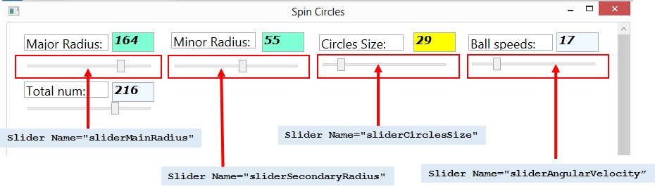

<properties
pageTitle= 'simple animation by WFP and UWP'
description= "how to generate spinning circles in Windows"
documentationcenter: na
services=""
documentationCenter="na"
authors="fabferri"
manager=""
editor=""/>

<tags
   ms.service="configuration-Example-WFP"
   ms.devlang="na"
   ms.topic="article"
   ms.tgt_pltfrm="na"
   ms.workload="na"
   ms.date="02/01/2015"
   ms.author="fabferri" />

# Spinning circles in WPF and UWP

Animation is an exciting topic of investigation and the main baseline for gaming. The term "animation" simply means that something is changing over time.  It's most commonly associated with changing motion over time (movement). WPF offers different methods to make animation and many examples are available in internet. The article speaks about how to spin multiple circles inside a canvas. In general animation requires some manner of custom code to be executed in a loop, in real time. In our post two different ways to implement animation are discussed:
* **timer-based animation**: this approach is based on set up a timer and a call-back function that is periodically called back based on the frequency of the timer
* **frame-based animation**: this method is created by attaching an event handler to the static Rendering event on **System.Windows.Media.CompositionTarget** class.
Let start our discussion from mathematic prospective; to spin circles we use the following vectorial expression in parametric form:

[![1]][1]

The Cartesian coordinate (abscissa and ordinate) are:

X<sub>i</sub>(t)=X0+R\*cos&theta;<sub>i</sub>(t)+r\*cos &alpha;<sub>i</sub>(t)
Y<sub>i</sub>(t)=Y0+R\*sin&theta;<sub>i</sub>(t)+r\*sin &alpha;<sub>i</sub>(t)
&theta;<sub>i</sub>(t<sub>j</sub>)=&theta;<sub>i</sub>(t<sub>j-1</sub>)+v
&alpha;<sub>i</sub>(t<sub>j</sub>)=&alpha;<sub>i</sub>(t<sub>j-1</sub>)+v2
v=(&pi;/180)\*(N/10)
v2=(&pi;/180)\*(0.3*k)   k=0,1,2,...N-1

where the variables:
* t is the time
* Xi(t) is the x-coordinate of the center of the circle at time t
* Yi(t) is the y-coordinate of the center of the circle at time t
* N is the total number of circles
* R is the main radius
* r is the secondary radius
* X0 is the x-coordinate of the center of main radius R
* Y0 is the y-coordinate of the center of secondary radius r
* i is the index of circle (identifier of specific circle) in the range [0,N-1]
* i(tj) is the angular velocity of main radius R of circle j at time t 
* i(tj)is the angular velocity of secondary radius r of circle j at time t
* v is the variation of angular velocity of main radius R
* v2 is the variation of angular velocity of secondary radius r


To correct position all the circles at initial time (t=0) we use the following initial condition
&theta;<sub>i</sub>(t=0)=(&pi;/180)\*(360\*k/N);    k=0,1,2,3...,N-1
&alpha;<sub>i</sub>(t=0)=(&pi;/180)\*(360\*k/N);    k=0,1,2,3...,N-1

Effect of parametric equation is to spin every circle around the main radius R with center (X0, Y0) and simultaneously around the secondary radius r with origin in the head of radius R.
In canvas the origin of x-coordinate and y-coordinates is taken respect to top-left corner of canvas control: adding X0 and Y0 to the equation translates the origin of main radius R in the center of canvas control:

As shown in the picture above, &theta;(t) is the angle subtending the main radius R and the horizontal axis passing through its center , and &aplha;(t) is the angle subtending the secondary radius r and the horizontal axis passing through its center.
In **System.Windows.Shapes** doesn’t exit the class Circle but we can use Ellipse with Width = Height to shape ellipse in circle.
As described in [How to: Draw an Ellipse or a Circle](http://msdn.microsoft.com/en-us/library/ms751563.aspx) to draw a circle in a canvas we can use methods:

```java
Canvas canv = new Canvas();
Ellipse myEllipse = new Ellipse();
myEllipse.Width =100;
myEllipse.Height =100;
myEllipse.Fill = Brushes.Blue;
Canvas.SetLeft(myEllipse, desiredCenterX - (myEllipse.Width/2));
Canvas.SetTop(myEllipse, desiredCenterY - (myEllipse.Height/2));
canv.Children.Add(myEllipse);
```

The (desiredCenterX, desiredCenterY) is the coordinate of the ellipse center.
To position child canvas element we can use **Canvas.SetLeft** and **Canvas.SetTop**; coordinates of child element is taken respect to left edge and top edge of canvas. The figure 2 and figure 3 show the coordinates of the center of the circle respect to the canvas control.

[![2]][2]

[![3]][3]

Now it is clear how to draw a single circle in the canvas; our final goal is to draw a large number of circles and most easy way implementation can be done through multiple arrays associated each with ellipse property:

```java
// maximum size of array of Ellipse objects
public static int TotNumCircles = 200;  
// array of "System.Windows.Shapes.Ellipse" objects                    
public static Ellipse[] ellip = new Ellipse[TotNumCircles]; 
// array of x-coordinate the centers of the ellipses 
public double[] x = new double[TotNumCircles];  
// array of y-coordinate the centers of the ellipses
public double[] y = new double[TotNumCircles];  
// angle of main radius R        
public double[] theta = new double[TotNumCircles];
// angle of secondary radius r  
public double[] alfa = new double[TotNumCircles];   
// angular velocity of main radius R
public double[] v = new double[TotNumCircles]; 
// angular velocity of secondary radius r
public double[] v2 = new double[TotNumCircles]; 
```

Every ellipse is unique identified by index k=0,1,2,3…, TotNumCircles-1 of related array.

[![4]][4]

In XAML file of our Visual Studio project, we have four controls types:
* a **ScrollViewer** control provides  a convenient way to enable scrolling of content in our WPF applications. The **HorizontalScrollBarVisibility** property is enabled that indicates a horizontal ScrollBar is displayed.
* canvas is added as child of ScrollViewer. Canvas defines an area within which we can explicitly position child elements by using coordinates that are relative to the Canvas area.
* We have  five different controls **System.Windows.Controls.Slider** to change parameters in the equation:

| Slider Name                           |      What’s changed              |
|---------------------------------------|:--------------------------------:|
| Slider Name="sliderMainRadius"        |  main radius R                   |
| Slider Name="sliderSecondaryRadius"   |   secondary radius r             |
| Slider Name="sliderCirclesSize"       | diameter of circles              |
| Slider Name="sliderAngularVelocity"   | angular velocity of circles      |
| Slider Name="sliderTotalCirclesNumber"| total number of circle in canvas |

To show value of slider in a Textbox, we use in XAML file the slider as binding source object of Textbox control:   

```XML
<Slider Name="myslider" ValueChanged="mySlider_ValueChanged"/>
<TextBox Name="myTextBox" Text="{Binding ElementName=mySlider, Path=Value}" />
```
The Name property represents name of the control, which is a unique identifier inside the tree. The Minimum and Maximum properties represent the minimum and maximum values of the slider range. Now, on the **ValueChanged** event of slider controls, we simply write the code to update the program variable of parametric equation.


### <a name="iperf3"></a>1. timer-based animation
So far, we have built all elements to draw circles in a canvas; what is missing is our animation.
WPF is designed to save developers from the difficulties of threading. Typically, WPF applications start with two threads: one for handling rendering and another for managing the UI. The rendering thread effectively runs hidden in the background while the UI thread receives input, handles events, paints the screen, and runs application code. Most applications use a single UI thread.
The UI thread queues work items inside an object called a **Dispatcher**. The **System.Windows.Threading.Dispatcher** class provides services for managing the queue of work items for a thread. The Dispatcher orders the elements in its queue by priority. There are ten levels that may be specified when adding an element to the Dispatcher queue. These priorities are maintained in the DispatcherPriority enumeration. The Dispatcher selects work items on a priority basis and runs each one to completion.  Every UI thread must have at least one Dispatcher, and each Dispatcher can execute work items in exactly one thread.
Time-based animation can be implemented in WPF through System.Windows.Threading.DispatcherTimer class,  a timer that is integrated into the Dispatcher queue which is processed at a specified interval of time and at a specified priority. Initializes a new instance of the DispatcherTimer class which processes timer events at a priority specified with the DispatcherPriority can be done through the statement

```java
DispatcherTimer timer = new System.Windows.Threading.DispatcherTimer((DispatcherPriority));
```

Next step is choice a strategy to add a **DispatcherTimer** to our project.
In WPF all elements have got lifetime events; the Loaded event (lifetime event) says that the visual tree is not only built and initialized, but layout has run on it, data has been bound, it's connected to a rendering surface (window) and you're on the verge of being rendered.  When we reach that point, we canvas the tree by broadcasting the Loaded event, starting at the root. Therefore, Loaded event occurs when the element is laid out, rendered, and ready for interaction. 
In our project we can add to the Loaded event a **RoutedEventHandler** that allows to call the  **Window1_Loaded()** function containing a new instance of **DispatcherTimer**.

```java
Loaded += new System.Windows.RoutedEventHandler(Window1_Loaded);
```
The DispatcherTimer class supports specifying an interval between ticks as well as the code to run when the timer's event fires; in our project DispatcherTimer is create with following code:

```java
void Window1_Loaded(object sender, RoutedEventArgs e)
{
    // Create a Timer with a highest priority
     DispatcherTimer timer = new DispatcherTimer(DispatcherPriority.Send);
    // Set the Interval to 2 seconds
     timer.Interval = TimeSpan.FromMilliseconds(5);
    // Set the callback to invoke every tick time
     timer.Tick += new EventHandler(timer1_Tick);
     // Start the timer
     timer.Start();
}
private void timer1_Tick(object sender, EventArgs e)
{
     for (int j = 0; j < TotNumCircles; j++)
     {
         theta[j] = theta[j] + v[j];
         alfa[j] = alfa[j] + v2[j];
         x[j] = X0 + circleSize / 2 + (R * Math.Cos(theta[j])) 
                   + (r * Math.Cos(alfa[j]));
         y[j] = Y0 + circleSize / 2 + (R * Math.Sin(theta[j])) 
                   + (r * Math.Sin(alfa[j]));
         Canvas.SetLeft(ellip[j], x[j]);
         Canvas.SetTop(ellip[j], y[j]);
    }
}

```

By default the DispatcherTimer tied to Dispatcher uses the Normal Priority but in our case we set the DispatcherPriority to the highest value (DispatcherPriority.Send).

### <a name="iperf3"></a>2. frame-based animation
Structure of our project remains roughly the same, but we need to replace the DispatcherTimer with frame-based mechanism. WPF provides a way to create frame-based animation by attaching an event handler to the static Rendering event on System.Windows.Media.CompositionTarget.
The System.Windows.Media.CompositionTarget class is a static class which represents the display surface on which your application is being drawn. 
In other words every time a scene is drawn to screen, the CompositionTarget class raises the Rendering event to notify any event handlers that a frame has been rendered.
The static CompositionTarget.Rendering event is raised post-layout and pre-render once per frame.
To terminate the animation can be done with detach of the event handler.
The Rendering event occurs just before the objects in the composition tree are rendered.
Using the frame-based Rendering event is the preferred approach because provide the best performance.
One aspect to consider with CompositionTarget is that the frames-per-second (fps) rate may differ from machine to machine: factors such as hardware and system workload will affect how many times per second the rendering event will be fired.
Animation of circles is created adding an EventHandler:

```java
CompositionTarget.Rendering += new EventHandler(RenderFrame);
```
or in alternative way
```java
CompositionTarget.Rendering += RenderFrame;
```
The frame Rendering event calls the Rendering event handler that we have named RenderFrame which increase at every frame the angular speed of every circle of an amount equal to the variation of angular velocity, v[j] for main radius R and v2[j] for the secondary radius r:

```java
public void RenderFrame(object sender, System.EventArgs e)
{
      for (int j = 0; j < TotNumCircles; j++)
      {
         theta[j] = theta[j] + v[j];
         alfa[j] = alfa[j] + v2[j];
         x[j] = X0 + circleSize / 2 + (R * Math.Cos(theta[j])) 
                   + (r * Math.Cos(alfa[j]));
         y[j] = Y0 + circleSize / 2 + (R * Math.Sin(theta[j])) 
                   + (r * Math.Sin(alfa[j]));
          Canvas.SetLeft(ellip[j], x[j]);
          Canvas.SetTop(ellip[j], y[j]);
      }
}
```



[![6]][6]


### <a name="iperf3"></a>3. Note
In UWP you can sideload the apps on unmanaged devices by following steps:
To turn on sideloading for unmanaged devices
1. Open **Settings**.
2. Click **Update & Security** > **For developers**.
3. On **Use developer features**, select **Sideload apps**.

As next step, import the security certificate:
1. Open the security certificate for the appx package, and select **Install Certificate**.
2. On the **Certificate Import Wizard**, select **Local Machine**.
3. Import the certificate to the **Trusted Root Certification Authorities** folder.

<!--Image References-->

[1]: ./media/math-function.jpg "math function"
[2]: ./media/canvas-coordinate1.jpg "canvas coordinate X"
[3]: ./media/canvas-coordinate2.jpg "canvas coordinate Y"
[4]: ./media/spinning-circles1.jpg "circles and coordinates"
[5]: ./media/app-controls.jpg "application controls"
[6]: ./media/spinning-circles.mp4 "video"
<!--Link References-->

